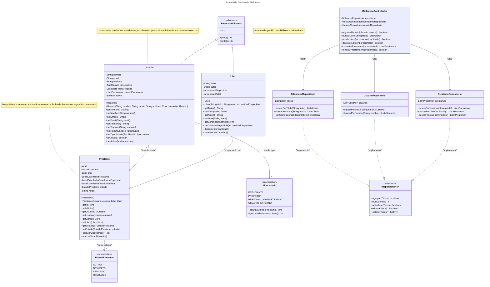

# Diagrama UML - Sistema de Biblioteca

## Diagrama de Clases Principal

```mermaid
---
title: Sistema de Gestión de Biblioteca
---
classDiagram
    %% Clases principales del modelo
    class RecursoBiblioteca {
        <<abstract>>
        -int id
        +getId() int
        +setId(int id)
    }
    
    class Usuario {
        -String nombre
        -String email
        -String telefono
        -TipoUsuario tipoUsuario
        -LocalDate fechaRegistro
        -List~Prestamo~ historialPrestamos
        -boolean activo
        +Usuario()
        +Usuario(String nombre, String email, String telefono, TipoUsuario tipoUsuario)
        +getNombre() String
        +setNombre(String nombre)
        +getEmail() String
        +setEmail(String email)
        +getTelefono() String
        +setTelefono(String telefono)
        +getTipoUsuario() TipoUsuario
        +setTipoUsuario(TipoUsuario tipoUsuario)
        +isActivo() boolean
        +setActivo(boolean activo)
    }
    
    class Libro {
        -String titulo
        -String autor
        -int cantidadDisponible
        -int cantidadTotal
        +Libro()
        +Libro(String titulo, String autor, int cantidadDisponible)
        +getTitulo() String
        +setTitulo(String titulo)
        +getAutor() String
        +setAutor(String autor)
        +getCantidadDisponible() int
        +setCantidadDisponible(int cantidadDisponible)
        +decrementarCantidad()
        +incrementarCantidad()
    }
    
    class Prestamo {
        -int id
        -Usuario usuario
        -Libro libro
        -LocalDate fechaPrestamo
        -LocalDate fechaDevolucionEsperada
        -LocalDate fechaDevolucionReal
        -EstadoPrestamo estado
        -String notas
        +Prestamo()
        +Prestamo(Usuario usuario, Libro libro)
        +getId() int
        +setId(int id)
        +getUsuario() Usuario
        +setUsuario(Usuario usuario)
        +getLibro() Libro
        +setLibro(Libro libro)
        +getEstado() EstadoPrestamo
        +setEstado(EstadoPrestamo estado)
        +calcularDiasRetraso() int
        +marcarComoDevuelto()
    }
    
    class TipoUsuario {
        <<enumeration>>
        ESTUDIANTE
        PROFESOR
        PERSONAL_ADMINISTRATIVO
        USUARIO_EXTERNO
        +getDiasMaximoPrestamo() int
        +getCantidadMaximaLibros() int
    }
    
    class EstadoPrestamo {
        <<enumeration>>
        ACTIVO
        DEVUELTO
        VENCIDO
        RENOVADO
    }
    
    %% Controladores
    class BibliotecaControlador {
        -BibliotecaRepositorio repositorio
        -PrestamoRepositorio prestamoRepositorio
        -UsuarioRepositorio usuarioRepositorio
        +registrarUsuario(Usuario usuario) boolean
        +buscarLibro(String titulo) List~Libro~
        +prestarLibro(int usuarioId, int libroId) boolean
        +devolverLibro(int prestamoId) boolean
        +consultarPrestamos(int usuarioId) List~Prestamo~
        +renovarPrestamo(int prestamoId) boolean
    }
    
    %% Repositorios
    class IRepositorio~T~ {
        <<interface>>
        +agregar(T item) boolean
        +buscar(int id) T
        +actualizar(T item) boolean
        +eliminar(int id) boolean
        +obtenerTodos() List~T~
    }
    
    class BibliotecaRepositorio {
        -List~Libro~ libros
        +buscarPorTitulo(String titulo) List~Libro~
        +buscarPorAutor(String autor) List~Libro~
        +verificarDisponibilidad(int libroId) boolean
    }
    
    class UsuarioRepositorio {
        -List~Usuario~ usuarios
        +buscarPorEmail(String email) Usuario
        +buscarPorNombre(String nombre) List~Usuario~
    }
    
    class PrestamoRepositorio {
        -List~Prestamo~ prestamos
        +buscarPorUsuario(int usuarioId) List~Prestamo~
        +buscarPorLibro(int libroId) List~Prestamo~
        +buscarPrestamosVencidos() List~Prestamo~
    }
    
    %% Relaciones de herencia
    RecursoBiblioteca <|-- Usuario
    RecursoBiblioteca <|-- Libro
    
    %% Relaciones de composición y agregación
    Usuario "1" --o "*" Prestamo : "tiene historial"
    Libro "1" --o "*" Prestamo : "es prestado en"
    Usuario "*" --> "1" TipoUsuario : "es de tipo"
    Prestamo "*" --> "1" EstadoPrestamo : "tiene estado"
    
    %% Relaciones con repositorios
    BibliotecaRepositorio ..|> IRepositorio : "implementa"
    UsuarioRepositorio ..|> IRepositorio : "implementa"
    PrestamoRepositorio ..|> IRepositorio : "implementa"
    
    %% Relaciones del controlador
    BibliotecaControlador --> BibliotecaRepositorio : "usa"
    BibliotecaControlador --> UsuarioRepositorio : "usa"
    BibliotecaControlador --> PrestamoRepositorio : "usa"
    
    %% Notas
    note "Sistema de gestión para biblioteca universitaria"
    note for Usuario "Los usuarios pueden ser estudiantes,\nprofesores, personal administrativo\no usuarios externos"
    note for Prestamo "Los préstamos se crean automáticamente\ncon fecha de devolución según tipo de usuario"
```